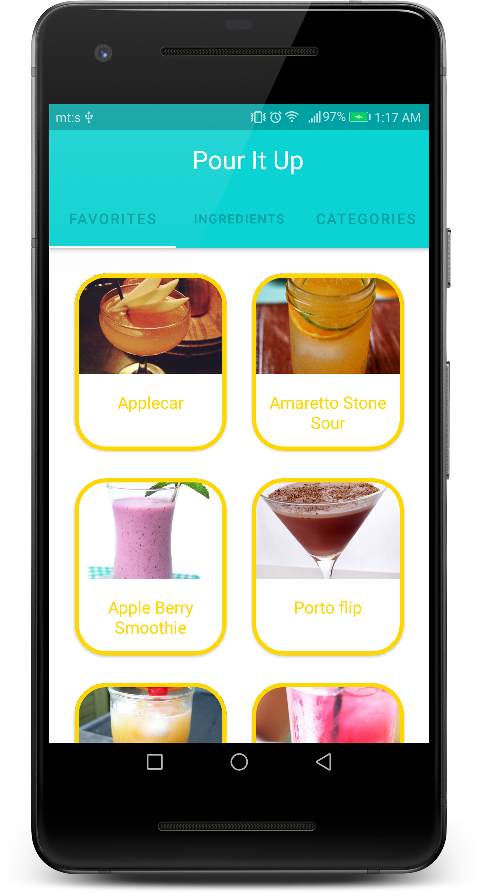
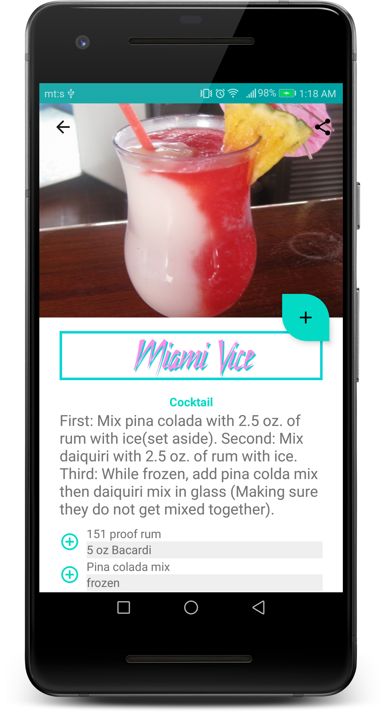
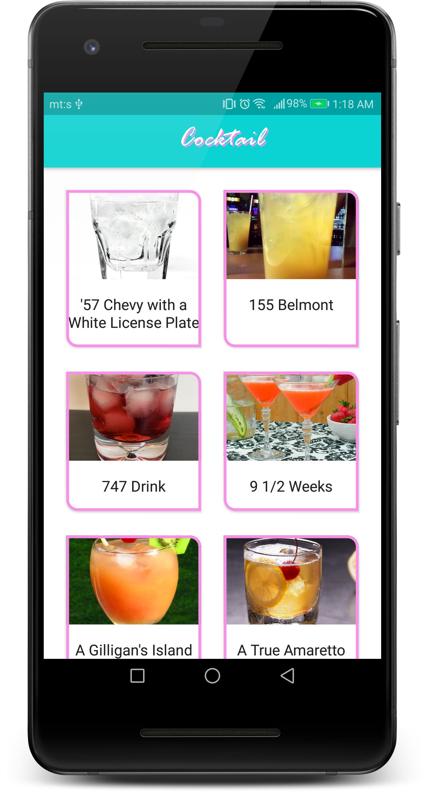
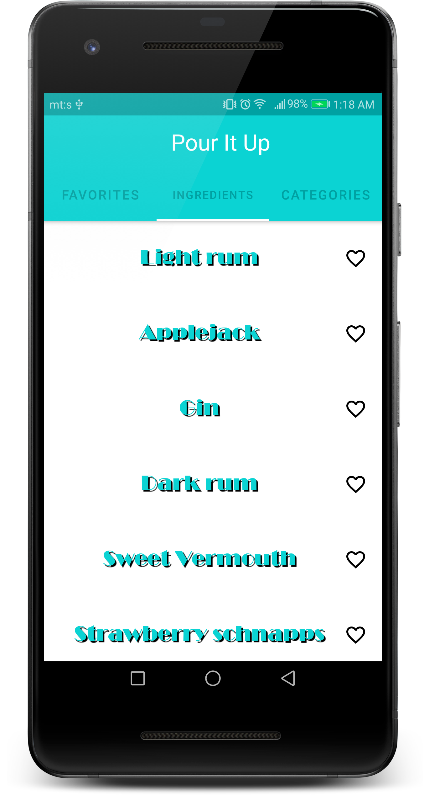
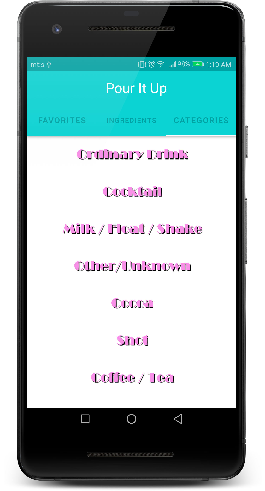

# Pour It Up

Pour it up is a simple demo app witch allows you to chose recipies of coctails or any other drink by ingredients or categories. As well, saving your fav drinks into local database is one of options.

# Basic

-App is writen in Kotlin and MVVM is architectural pattern that is used in this project.
-Perform networking with Retrofit.
-Create query and update data from tables within a database using a Room and create the database schema.
-API used in this project [The Cocktail DB](https://rapidapi.com/theapiguy/api/the-cocktail-db?endpoint=apiendpoint_b2280d27-a2ef-4de9-be14-8c3f88f2d9ec)

## Libraries Used
Focus on [Android Jetpack](https://developer.android.com/jetpack) as core of this project
[Android KTX](https://developer.android.com/kotlin/ktx) - Write more concise, idiomatic Kotlin code.

[Arhitecture](https://developer.android.com/topic/libraries/architecture)
 -  [ViewPager2](https://developer.android.com/jetpack/androidx/releases/viewpager2)
 -  [Data Binding](https://developer.android.com/topic/libraries/data-binding/)
 - [Lifecycles](https://developer.android.com/topic/libraries/architecture/lifecycle)
 - [LiveData](https://developer.android.com/topic/libraries/architecture/livedata)
 - [Navigation](https://developer.android.com/guide/navigation/)
 - [Room](https://developer.android.com/topic/libraries/architecture/room)
 - [ViewModel](https://developer.android.com/topic/libraries/architecture/viewmodel)

[UI](https://developer.android.com/guide/topics/ui)
 - [Fragment](https://developer.android.com/guide/components/fragments)
 - [Layout](https://developer.android.com/guide/topics/ui/declaring-layout)

Third party
 - [Glide](https://bumptech.github.io/glide/) image loading
 - [Grupie](https://github.com/lisawray/groupie) RecyclerView layouts
 - [Retrofit](https://square.github.io/retrofit/) Android HTTP Client
 - [Kotlin Coroutines](https://kotlinlang.org/docs/reference/coroutines-overview.html) or managing background threads
  - [Kodein](https://kodein.org/Kodein-DI/?5.0/android) DI on Android
## Screenshots

## Others

  - [Icon](https://www.flaticon.com/free-icon/cocktail_955836?term=cocktail&page=1&position=32)
  - Fonts: - [BroadwayD](https://www.wfonts.com/font/broadwayd) , [Rage Italic](https://www.dafontfree.net/freefonts-rage-italic-f65266.htm) , [Still Time](https://www.dafont.com/still-time.font)
  - App colors and design inspired by game GTA Vice City and TV Show Miami Vice

## Licence

**No Licence**

